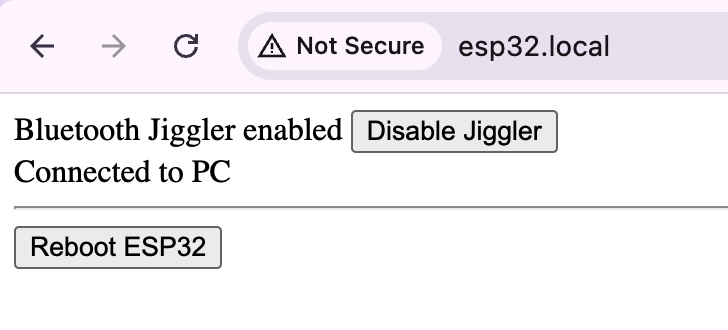

# ESP32 Bluetooth Mouse Jiggler

Turn your EPS32 board into a bluetooth mouse and make it jiggle so your computer never goes to sleep.

Excellent tool for those of you slackers working from home :smile:

## Usage
After powering up the board it will try to connect to the Wi-Fi network. Once it is connected, it will start
the MDNS (Bonjour) responder, which will make it accessible as [esp32.local](http://esp32.local) on your
network. Start bluetooth device search on your computer and pair it with "ESP32 Bluetooth Mouse" device.
Once paired, it will move the mouse one pixel up and down every minute, which should be enough to prevent
your computer going to idle/sleep mode, and e.g. your MS Teams will show you as Available (green).

Using a browser, you can connect to the web server running on your EPS32 board by entering http://esp32.local
in the address bar. You can safely ignore the "Not Secure" warning and you can see a simple page to control
your virtual bluetooth mouse:

## Dependencies
- [ESP32-BLE-Mouse](https://github.com/T-vK/ESP32-BLE-Mouse)
